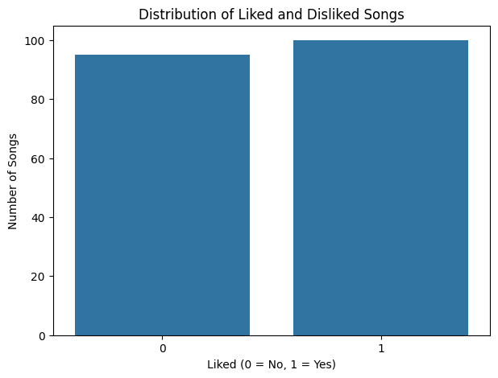
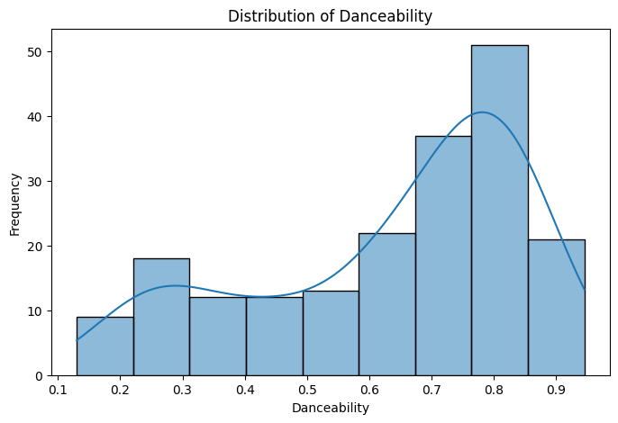
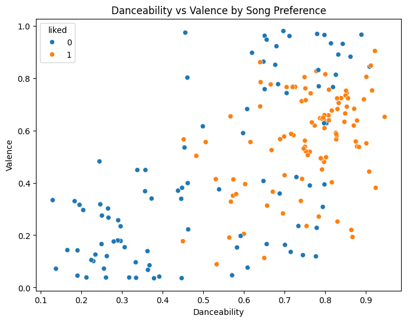

# Spotify-Recommendation-system

This project aims at build a model that with recommend music of certain similar characteristics to the users using Spotify. 
## Problem Statement.
* Music streaming platform contain a large number of songs, making it difficult users to discover songs that match their personal preferences.
* This project aims to analyze users' songs preferences using audio features such as danceability, energy, acousticness, valance, tempo nd loudness and develop a system that can predict whether a user is a likely to enjoy a song and recommend songs with similar characteristics.
## Aim of Analysis.
* To investigate the relationship between song audio features and user preferences in order to identify patterns that can be used to predict whether a user will like a song and recommend suitable songs.
## Business Understanding.
(a)What are the characteristics of the songs in the dataset?
(b)Which audio features are associated with the songs being liked?
(c)Which model predicts whether the song is liked?
(d)Can i recommend suggested songs with user preferences?

## Data understanding
* The dataset source is from [kaggle](https://www.kaggle.com/datasets/bricevergnou/spotify-recommendation)
   * * Key features;*
* Danceability- how suitable a song is for dancing,from low to high
* Energy- how intense the song is
* speechiness - amount of spoken words in the song
* Acousticness - how acoustic the song sounds
* Instrumentalness - likelihood that the song contains little/no vocals
* Liveness - likelihood that the recoding sounds like a live performance.
* Valance- musical positivity/happiness of a song
* Tempo - speed of the song, measured in BPM.
* liked - whether the user liked the song; 1= liked, 0= not liked

## DATA VISUALIZATIONS.

### Findings
 100 songs liked
* 95 songs not liked
* The target class is relatively balanced hence good for classification.

### Findings
* The distribution is negatively (left) skewed because most observations are concentrated at higher danceability vales while a smaller number tracks have low danceability.

### Findings
 * The scatter plot indicates a positive relationship between danceability and valence. Liked songs tend to be concentrated at higher danceability and moderate-to-high valence levels, although there is considerable overlap between liked and disliked songs.
* This suggests that danceability and valence may contribute to predicting song preference but are not sufficient on their own.

### MODEL AND EVALUATION
* Select audio features
* Standardscaler
* Cosine Similarity
* Create user Preference Profile
* Compare Songs to user Profile
* Remove Already liked songs
* Top  10 recommendations

## Conclusion
* The dataset demonstrates that the user's music preferences are influenced by multiple audio characteristics. The user generally tends to prefer more danceable,energetic , positive-sounding and faster songs. 
* These patterns can be exploited to develop a content-based music recommendation system that recommends songs with audio characterictics similar to those of songs the user has previously liked.

### Recommendations
1. Use multiple audio features
2. Use machine-learning classification
 * Logistic Regression - baseline
 * Decision tree - easy to intepret.
 * Random Forest - best for the model
 * KNN- useful because it works with similarity

  

